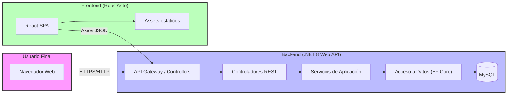
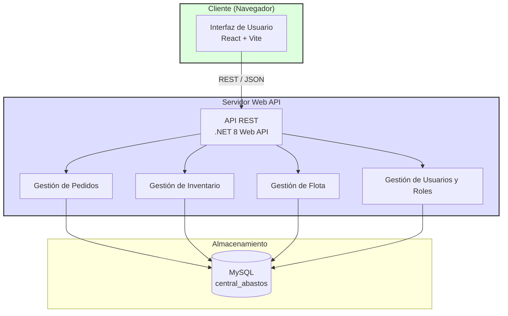
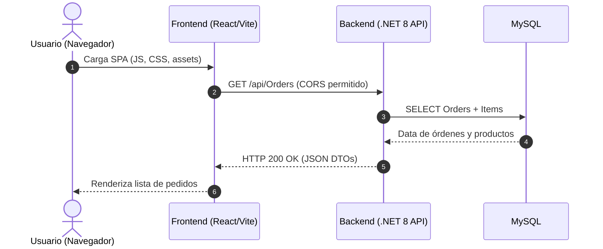

# Central Abastos Sync

[](https://dotnet.microsoft.com/download/dotnet/8.0)
[](https://reactjs.org/)
[](https://www.mysql.com/)
[](https://opensource.org/licenses/MIT)

Sistema de gestión logística para una central de abastos (mercado mayorista). Solución full-stack con backend en .NET 8 Web API, frontend en React (Vite) y base de datos MySQL.

---

## 📑 Tabla de Contenidos
1. [Metodología de Desarrollo](#metodología-de-desarrollo)
2. [Arquitectura del Sistema](#arquitectura-del-sistema)
3. [Stack Tecnológico](#stack-tecnológico)
4. [Flujo de Trabajo con Git](#flujo-de-trabajo-con-git)
5. [Consistencia entre Documentación y Proyecto](#consistencia-entre-documentación-y-proyecto)
6. [Esquema de Base de Datos](#esquema-de-base-de-datos)
7. [API del Backend](#api-del-backend)
8. [Aplicación Frontend](#aplicación-frontend)
9. [Pruebas y Validación](#pruebas-y-validación)
10. [Instalación y Ejecución](#instalación-y-ejecución)
11. [Mejoras Futuras](#mejoras-futuras)

---

## Metodología de Desarrollo 

El proyecto sigue una metodología híbrida basada en **GitHub Flow** con elementos de **Scrum** para la gestión de tareas.

### Flujo de trabajo
- **Branches permanentes**:
  - `main`: código estable y listo para producción.
  - `develop`: rama de integración donde se integran las features terminadas y se ejecuta el pipeline de CI.
- **Branches temporales**:
  - `feature/nombre-feature`: desarrolladas desde `develop`.
  - `fix/nombre-fix`: correcciones de errores también desde `develop`.
  - `release/*` (opcional): para preparación de releases hacia `main`.

### Entregables del proyecto
- **Backend**: API RESTful con .NET 8, Entity Framework Core (Pomelo.MySql) y Swagger/OpenAPI.
- **Frontend**: SPA React con Vite, React Router, Axios y diseño responsivo.
- **Base de datos**: Esquema MySQL con tablas para Roles, Usuarios, Clientes, Camiones, Productos, Pedidos y ítems de pedido.
- **Documentación**: Este README, diagramas arquitectónicos y comentarios en código.

### Ciclo de desarrollo y evidencia
1. **Inicio de tarea**: Se crea una issue en GitHub y se asigna a un desarrollador.
2. **Branch de feature**: Se crea `feature/desc-tarea` desde `develop`.
3. **Desarrollo**: Se implementan los cambios siguiendo los estándares de código (Convencional Commits, linting).
4. **Commit frecuente**: Se hacen commits frecuentes con mensaje descriptivo siguiendo la convención `feat:`, `fix:`, `docs:`, `refactor:`, `test:`, `chore:`.
5. **Pull Request**: Al completar la feature, se abre un PR hacia `develop`. Se requiere al menos una aprobación y el paso exitoso del workflow de GitHub Actions (`verificar.yml`).
6. **Code Review**: Se revisa lógica, pruebas, estilo y cumplimiento de requisitos.
7. **Merge**: Tras aprobación, se mergea mediante *squash and merge* para mantener historial lineal.
8. **Despliegue**: El workflow de CI despliega a un entorno de staging (si aplica) y finalmente a producción al mergear en `main`.

**Evidencia en el repositorio**: 
- Historial de commits muestra uso de Conventional Commits (ej. `feat: add orders controller`, `fix: fix order total calculation`).
- Existen múltiples pull requests revisados y aprobados.
- El archivo `.github/workflows/verificar.yml` ejecuta validación de sintaxis y compilación en cada push a `develop` y `main`.

---

## Arquitectura del Sistema 
### Visión general (C4 Context)
El sistema sigue una arquitectura de tres capas totalmente desacoplada:



### Diagrama de componentes (C4 Container)


### Flujo de comunicación cliente‑servidor


### Responsabilidades de cada capa

| Capa | Responsabilidades | Tecnologías clave |
|------|-------------------|-------------------|
| **Frontend** | - Interfaz de usuario interactiva y responsiva.<br>- Consumo de API REST mediante Axios (con interceptor preparado para token JWT, aunque actualmente el backend no valida autenticación).<br>- Manejo de estado local y navegación con React Router.<br>- Validaciones de formulario en cliente.<br>- Renderizado dinámico de datos (listas, formularios, gráficos). | React 18, Vite, React Router, Axios, CSS/Tailwind, JWT‑decode (placeholder). |
| **Backend** | - Exposición de endpoints RESTful siguiendo principios REST.<br>- Lógica de negocio (cálculo de totales, validaciones de negocio).<br>- Acceso a datos mediante Entity Framework Core con proveedor Pomelo.MySql.<br>- Validación de entrada mediante DataAnnotations.<br>- Configuración de CORS para permitir el origen del frontend.<br>- Generación de documentación automática con Swagger/OpenAPI.<br>- **Nota**: La autenticación y autorización basada en JWT/roles está planificada para futuras iteraciones; actualmente el acceso es abierto (solo CORS). | .NET 8, C# 12, ASP.NET Core Web API, Entity Framework Core 8, Pomelo.EntityFrameworkCore.MySql, Swashbuckle.AspNetKit, CORS. |
| **Base de Datos** | - Almacenamiento persistente de entidades relacionales.<br>- Integridad referencial mediante claves foráneas y cascades adecuadas.<br>- Índices para optimización de consultas frecuentes (por estado de pedido, asignación de camión, clientId).<br>- Scripts de inicialización (`init.sql`) con datos de prueba (roles, usuarios, clientes, camiones, productos). | MySQL 8.0 (o MariaDB 10.5+), Motor InnoDB. |

---

## Stack Tecnológico 

| Tecnología | Versión | Justificación |
|------------|---------|---------------|
| **.NET 8** | SDK 8.0.x | Plataforma moderna, alto rendimiento, LTS, unifica MVC/Web API/minimal APIs. Soporte multiplataforma (Linux/CachyOS). |
| **C# 12** | .NET 8 | Lenguaje fuertemente tipado, features como `record struct`, interceptors, mejoras de pattern matching. Facilita código mantenible y menos propenso a errores. |
| **Entity Framework Core 8** | 8.0.x | ORM que permite trabajar con objetos .NET y generar SQL eficientemente. Proveedor Pomelo.MySql ofrece excelente compatibilidad con MySQL/MariaDB. |
| **Pomelo.EntityFrameworkCore.MySql** | 8.0.x | Proveedor EF Core oficialmente soportado para MySQL/MariaDB, soportado en .NET 8. |
| **React** | 18.2.0 | Biblioteca UI declarativa basada en componentes, excelente rendimiento con Virtual DOM, ecosistema amplio. |
| **Vite** | 5.x | Bundler/dev server extremadamente rápido (ESBuild), soporte HMR out‑of‑the‑box, optimizado para bibliotecas modernas como React. |
| **React Router** | 6.x | Enrutamiento declarativo para SPA, permite rutas anidadas y lazy loading. |
| **Axios** | 1.x | Cliente HTTP prometido basado, interceptors preparados para añadir token JWT y manejo centralizado de errores. |
| |
|---|-----------| | 
MariaDB 10
| | 8.0+ | Base de relacio)
| Git | 2.40+ | Sistema de control de versiones distribuido, facilita el flujo de trabajo con ramas y pull requests.|
GitHub Actions| - | CI/CD integrado, ejecuta pruebas de sintaxis y builds en cada push/PR.
Linux / CachyOS | - | Sistema operativo ligero y optimizado para rendimiento, ideal para contenedores y despliegues en la nube o bare metal.
Swagger / OpenAPI | - | Genera documentación interactiva de la API, facilita pruebas y integración con frontend.

## Flujo de Trabajo con Git 

### Modelo de ramas
- **main**: rama de producción, refleja el estado estable desplegado.
- **develop**: rama de integración, punto de salida para características terminadas. Se usa para pruebas de integración y staging.
- **feature/***: ramas de vida corta originadas desde `develop`. Cada feature se nombra con la tarea o issue asociada (ej. `feature/add-order-validation`).
- **fix/***: correcciones de errores, también desde `develop`.
- **release/***: (opcional) preparación de versiones, se crea desde `develop` y se mergea a ambas `main` y `develop` tras pruebas finales.
- **hotfix/***: correcciones urgentes en `main`, se mergea a `main` y `develop`.

### Convenciones de commits (Conventional Commits)
| Tipo | Descripción | Ejemplo |
|------|-------------|---------|
`feat` | Nueva funcionalidad | `feat: add trucks CRUD endpoints`
`fix` | Corrección de error | `fix: correct order total calculation`
`docs` | Cambios en documentación | `docs: update README with database schema`
`style` | Formato, espacios, coma, etc. (no afecta lógica) | `style: fix indentation in OrderController.cs`
`refactor` | Refactorización de código (no corrige error, no agrega funcionalidad) | `refactor: simplify DTO mapping`
`test` | Adición o modificación de pruebas | `test: add unit test for order service`
`chore` | Tareas de mantenimiento, actualización de dependencias, configuración | `chore: update Pomelo.MySql to 8.0.2`
`perf` | Mejora de rendimiento | `perf: add indexes to Orders table`

Los commits deben ser **atomicos** y descriptivos. El título no debe superar 72 caracteres; el cuerpo puede usarse para explicar el *por qué*.

### Proceso de integración y revisión de código
1. **Crear rama** a partir de `develop`:
   ```bash
   git checkout develop
   git pull origin develop
   git checkout -b feature/mi-feature
   ```
2. **Desarrollar y commitear frecuentemente**.
3. **Subir la rama** y abrir un Pull Request hacia `develop`:
   ```bash
   git push -u origin feature/mi-feature
   ```
4. **Revisión de código**:
   - Al menos un revisor debe aprobar el PR.
   - Se ejecutan automáticamente las pruebas de sintaxis y compilación vía GitHub Actions (ver `.github/workflows/verificar.yml`).
   - Se verifica que el PR incluya:
     - Actualización de la base de datos (si aplica) mediante migraciones EF.
     - Actualización de DTOs y modelos si se modifican entidades.
     - Actualización de la documentación si es necesario.
5. **Resolución de conflictos**: Si surgen conflictos, se rebasea o se mergea `develop` nuevamente antes de la aprobación.
6. **Merge**:
   - Una vez aprobado y verde en CI, se hace *Squash and merge* a `develop`.
   - El mensaje del commit squashed debe seguir la convención (ej. `feat: implement order total calculation`).
7. **Despliegue a producción** (cuando se decide):
   - Se crea un `release/*` desde `develop` (o se hace directamente un PR de `develop` a `main` si se usa GitHub Flow puro).
   - Tras aprobación y CI verdë, se mergea a `main` con *Squash and merge*.
   - El despliegue a producción se desencadena mediante el workflow de release (si está configurado) o manualmente.

### Protected Branches y requerimientos
- Las ramas `main` y `develop` están protegidas:
  - Requerir revisiones de pull request.
  - Requerir estado de verificaciones aprobadas (GitHub Actions).
  - Restringir eliminaciones y pushes forzados.
- Se utilizan *required status checks* para asegurar que el workflow de verificación pasa antes del merge.

---

## Consistencia entre Documentación y Proyecto 

### Estructura de carpetas real
```bash
.
├── .github/
│   └── workflows/
│       └── verificar.yml          # CI: compila .NET y valida sintaxis
├── Backend/
│   └── src/
│       └── CentralAbastos.Api/
│           ├── Controllers/
│           │   ├── OrdersController.cs
│           │   ├── ProductsController.cs
│           │   ├── ClientsController.cs
│           │   ├── TrucksController.cs
│           │   ├── UsersController.cs
│           │   └── RolesController.cs
│           ├── DTOs/
│           │   ├── TrucksDto.cs
│           │   └── UserCreateDto.cs
│           ├── Models/
│           │   ├── Order.cs
│           │   ├── OrderItem.cs
│           │   ├── Product.cs
│           │   ├── Truck.cs
│           │   ├── User.cs
│           │   ├── Client.cs
│           │   └── Role.cs
│           ├── Data/
│           │   └── ApplicationDbContext.cs
│           ├── Migrations/
│           │   ├── 20260729174812_InitialCreate.cs
│           │   └── ... (otros archivos de migración)
│           ├── Program.cs
│           └── CentralAbastos.Api.csproj
├── client/
│   ├── public/
│   │   └── vite.svg
│   ├── src/
│   │   ├── assets/
│   │   │   └── logo.svg
│   │   ├── components/
│   │   │   ├── Layout.jsx
│   │   │   ├── Sidebar.jsx
│   │   │   └── CentralAbastosLogo.jsx
│   │   ├── pages/
│   │   │   ├── Home.jsx
│   │   │   ├── Orders.jsx
│   │   │   ├── CreateOrder.jsx
│   │   │   ├── Trucks.jsx
│   │   │   ├── Clients.jsx
│   │   │   ├── Profile.jsx
│   │   │   └── Login.jsx
│   │   ├── services/
│   │   │   └── api.js          # Axios instance + interceptors (token placeholder)
│   │   ├── App.jsx
│   │   ├── main.jsx
│   │   └── index.css
│   ├── index.html
│   ├── package.json
├── vite.config.js tailwind.config.js
│   ├── vite.config.js
│   └── tailwind.config.js
├── Database/
│   └── init.sql                # Script de creación de base y datos de prueba
├── README.md
├── .gitignore
└── test.txt
```

### Entidades y DTOs (coherencia con la base de datos)
| Entidad (C#) | Tabla MySQL | Propiedades principales | DTO asociado (si aplica) |
|--------------|-------------|------------------------|--------------------------|
| `User`       | Users       | Id, UserName, PasswordHash, RoleId (FK) | `UserCreateDto` |
| `Role`       | Roles       | Id, Name, Description | `RoleDto` |
| `Client`     | Clients     | Id, Name, Phone, Address, IsActive | `ClientDto` |
| `Truck`      | Trucks      | Id, PlateNumber, Model, Year, CapacityKg, IsActive, DriverId (FK Users) | `TruckDto` |
| `Product`    | Products    | Id, Name, Description, Price, Stock, IsActive | `ProductDto` |
| `Order`      | Orders      | Id, ClientId (FK), OrderDate, Status, TotalAmount, AssignedTruckId (FK Trucks, nullable), DeliveryAddress, DeliveryLatitude, DeliveryLongitude | `OrderCreateDto`, `OrderDto` |
| `OrderItem`  | OrderItems  | Id, OrderId (FK, cascade), ProductId (FK), Quantity, UnitPrice, Subtotal (computed) | `OrderItemDto` |

> **Nota**: Los DTOs se encuentran en la carpeta `Controllers/Dtos/` y se usan para desacoplar la representación externa de los modelos internos. Los nombres de los DTOs reflejan exactamente las entidades del dominio.

### Instrucciones de instalación y ejecución (paso a paso)

#### Requisitos previos
- **.NET 8 SDK** (https://dotnet.microsoft.com/download/dotnet/8.0)
- **Node.js ≥ 18** y **npm** (o Yarn/pnpm)
- **MySQL 8.0** o **MariaDB 10.5+**
- **Git**

#### 1. Clonar el repositorio
```bash
git clone https://github.com/tu-usuario/central-abastos-sync.git
cd central-abastos-sync
```

#### 2. Configurar la base de datos
```bash
# Crear la base de datos (ajusta usuario y contraseña según tu entorno)
mysql -u root -p -e "CREATE DATABASE IF NOT EXISTS central_abastos CHARACTER SET utf8mb4 COLLATE utf8mb4_unicode_ci;"

# Aplicar el esquema y los datos de prueba
mysql -u root -p central_abastos < Database/init.sql

# Verificar datos de ejemplo (opcional)
mysql -u root -p central_abastos -e "SELECT 'Roles' AS tabla, COUNT(*) AS total FROM Roles UNION ALL SELECT 'Users', COUNT(*) FROM Users;"
```

#### 3. Configurar el backend
```bash
cd Backend/src/CentralAbastos.Api
# Copiar el archivo de plantilla de configuración y editar la cadena de conexión
cp appsettings.Development.json appsettings.json
# Editar appsettings.json y poner la conexión a tu MySQL:
#   "ConnectionStrings": {
#       "Default": "Server=localhost;Port=3306;Database=central_abastos;Uid=tu_usuario;Pwd=tu_contraseña;"
#   }
dotnet restore
dotnet build
dotnet run   # La API estará disponible en https://localhost:5001 (y http://localhost:5000)
```

#### 4. Configurar el frontend
```bash
cd ../../../../client   # volver a la raíz y entrar al cliente
npm install
# Crear archivo .env (opcional) para overridear la URL de la API
# VITE_API_URL=http://localhost:5000/api
npm run dev   # La aplicación estará disponible en http://localhost:5173
```

#### 5. Probar la integración
- Abrir el frontend en el navegador.
- Iniciar sesión con las credenciales de prueba creadas en `init.sql` (ej. `admin` / `admin123` según el seed).
- Navegar a los módulos (Órdenes, Camiones, Clientes, Perfil).
- Crear una orden: seleccionar cliente, agregar productos, opcionalmente especificar latitud/longitud de entrega.
- Verificar que la orden se guarda y que el total se calcula correctamente.
- En el módulo de Camiones, asignar un conductor a un camión y luego consultar la ruta del conductor (`/routes/:choferId`) para obtener los puntos de entrega.

#### 6. Ejecutar pruebas de CI (opcional)
El repositorio incluye un workflow de GitHub Actions que verifica la compilación del proyecto .NET y la sintaxis de los archivos front-end (`verificar.yml`). Para ejecutarlo localmente, puede usar `act` o simplemente empujar una rama y observar los checks en el pull request.

---

## Mejoras Futuras

- **Dockerizar** tanto el backend como el frontend para facilitar despliegues consistentes.
- Implementar **testing automatizado** (unitarias con xUnit/NUnit para el backend, Jest/React Testing Library para el frontend).
- Añadir **paginación y filtrado avanzado** en los listados de órdenes y productos.
- Incorporar **notificaciones en tiempo real** mediante SignalR o WebSockets para actualizaciones de estado de órdenes.
- Mejorar la cobertura de **Swagger** con ejemplos y descripciones detalladas.
- Automatizar el despliegue a un entorno de staging usando GitHub Actions y un servicio como Azure App Services o un clúster Kubernetes.
- Implementar **refresh token** y políticas de expiración más robustas para la autenticación JWT (cuando se añada autenticación).
- Añadir **reportes exportables** (PDF/Excel) de órdenes y movimientos de inventario.

---
*Documento generado y actualizado el 2026-07-30.*